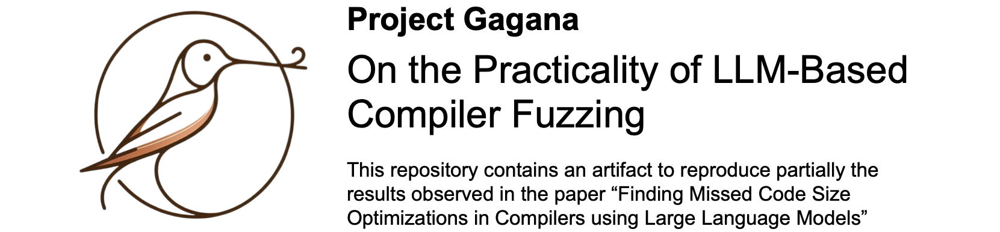

# Gagana

<p align="center">
  </br>
</p>

Recently, [Italiano and Cummins](https://arxiv.org/abs/2501.00655) introduced an elegant methodology for uncovering performance bugs in compilers. Their approach involves using a pre-trained large language model (LLM) to generate a seed program, followed by successive mutations designed to provoke unexpected behavior, even in mainstream compilers. This methodology is particularly appealing due to its language-agnostic nature: it can be adapted to different programming languages without the need to develop a dedicated fuzzer for each one. Moreover, it has proven highly effective, uncovering previously unknown (zero-day) performance bugs in widely used compilers such as Clang, ICC, and GCC.
In an effort to reproduce the results reported by Italiano and Cummins, we confirm that their technique outperforms general-purpose LLMs, such as open-source versions of LLaMA and DeepSeek, in identifying compiler performance bugs. However, we also observe that while the LLM-based approach is commendable, it lags behind tools like CSmith in terms of throughput (the number of bugs found over time) and latency (the time to discover the first bug). LLMs also require significantly greater computational resources.
Although this outcome may seem discouraging, it is important to note that we are comparing novel LLMs with a mature language-specific fuzzer. Nevertheless, as technology evolves, we expect the performance of LLM-based fuzzing to improve, potentially surpassing traditional methods in the future.

## Content

This repository contains an artifact of the entire generation and testing process for the article "On the Practicality of LLM-Based Compiler Fuzzing".

---

## Using Gagana

We use [**UV**](https://docs.astral.sh/uv/) as our Python package and project manager.
This ensures fast and reproducible environments with minimal configuration.


### 1. Install `uv`

Follow the official installation instructions:
👉 [UV Installation Guide](https://docs.astral.sh/uv/getting-started/installation/)


### 2. Install Code Generators

Install the traditional C code generators used for comparison:

* **[Csmith](https://github.com/csmith-project/csmith/)**
* **[Yarpgen](https://github.com/intel/yarpgen/)**

> Follow the respective installation instructions in each repository to build and set up the tools.


### 3. Install `GCC 14`

You may need **GCC 14** to compile the generated programs.
We recommend installing it via your system's package manager or from source.

On Ubuntu 24.04, you can use:

```bash
sudo add-apt-repository ppa:ubuntu-toolchain-r/test
sudo apt update
sudo apt install gcc-14 g++-14
```

> If your distro don't have gcc-14 on apt repository, you may build gcc 14 from source following the steps below.

```bash
apt install libmpfr-dev libgmp3-dev libmpc-dev -y
```

```bash
wget http://ftp.gnu.org/gnu/gcc/gcc-14.1.0/gcc-14.1.0.tar.gz
tar -xf gcc-14.1.0.tar.gz && cd gcc-14.1.0
```

```bash
./configure -v --build=x86_64-linux-gnu --host=x86_64-linux-gnu --target=x86_64-linux-gnu --prefix=/usr/local/gcc-14.1.0 --enable-checking=release --enable-languages=c,c++ --disable-multilib --program-suffix=-14
```

```bash
make
```

```bash
make install
```

```bash
export PATH=$PATH:/usr/local/gcc-14.1.0/bin
```


Make sure `gcc-14` and `g++-14` are available in your `PATH`.


### 4. Set up the Python environment

Create and activate a virtual environment with UV:

```bash
uv venv
uv pip install -e .
```

This will install the package in editable mode along with its dependencies.


### 5. Generating Code with LLMs

For the generation process using Large Language Models (LLMs), Google Colab Pro was utilized. This provided access to a GPU, which was essential for the computations.
To generate code samples using LLMs, open and run the following notebook step by step - you may need to upload to Google Colab.

```bash
notebooks/Gagana.ipynb
```

Or access the notebook on Google Colab using the following link:

[Google Drive File](https://drive.google.com/file/d/1A1MWOK_n6kl8IcV2fFyvTcUkqK2wodWO/view?usp=sharing)


Make sure the notebook dependencies are installed, including `ipykernel` if needed:

```bash
uv pip install notebook ipykernel
```


### 6. Generating Code with Traditional Fuzzers

After installing **Csmith** or **Yarpgen**, run:

```bash
uv run gagana-traditional
```

This will execute the traditional code generation pipeline.
You can pass arguments to configure the generation process as described in the script’s help section:

```bash
uv run gagana-traditional --help
```


### 7. Evaluating Generated Code

* **Traditional Fuzzer Outputs:**
  Automatically generate a `.csv` file with performance metrics and evaluation data after code execution.

* **LLM Outputs:**
  To evaluate LLM-generated code, run:

  ```bash
  uv run gagana-llm
  ```

  As with the traditional script, you can pass arguments as needed:

  ```bash
  uv run gagana-llm --help
  ```


